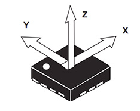
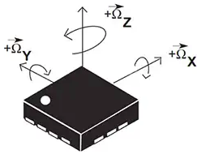
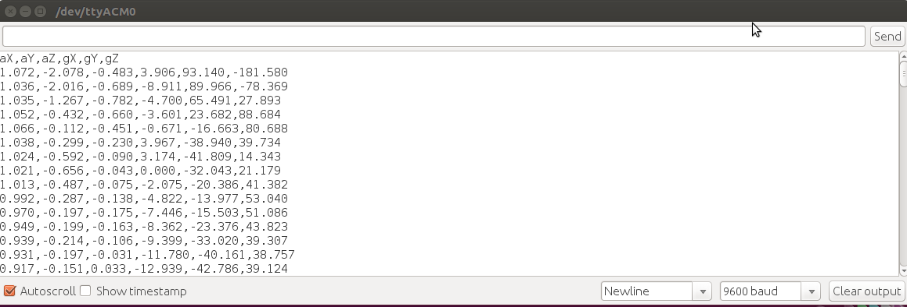
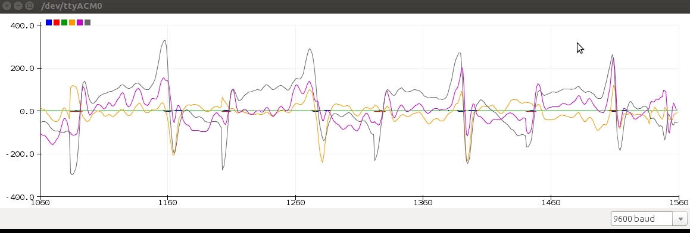
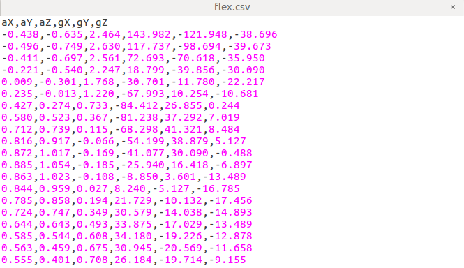
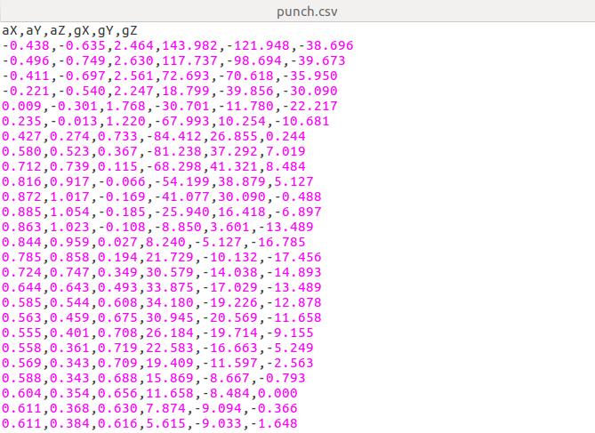
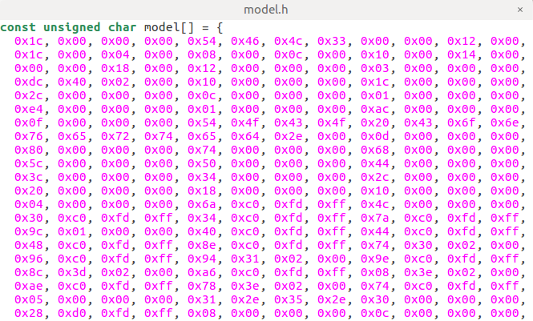
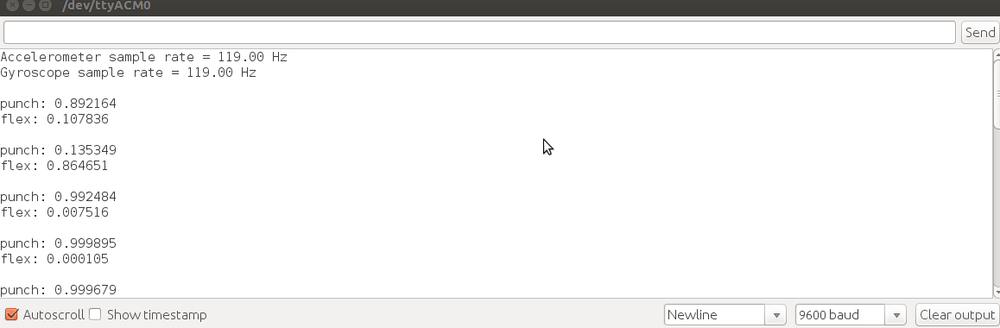

# Tinyml-on-the-edge
Arduino Nano 33 BLE Sense can be used to recognize gestures using machine learning. A tensorflow model is designed, built and trained using accelerometer and gyroscope sensors data on Google Colaboratory, which can handle jupyter notebooks online. The model is converted to tensorflow-lite model and later encoded on Arduino Nano 33 BLE Sense header file. A a gesture classifier uses the model to classify the data from both sensor types. IMU has numerous sensors including accelerometer, gyroscope and magnetometer. In this project, we are going to use accelerometer and gyroscope data to predict punch and flex gesture. This is based on [arduino tutorials](https://github.com/arduino/ArduinoTensorFlowLiteTutorials).

This project will follow the following procedure.
1. Revisit [setting up arduino IDE](https://github.com/billiyz/nano-33-ble-sense) without going through the programming part of sensor data collection.
2. Look into accelerometer and gyroscope operation
3. Write a sketch to collect accelerometer and gyroscope data
4. Upload the data to the google colaboratory platform
5. Train a neural network
6. Convert the trained model into tensorflow lite model
7. Encode the model in arduino header file

# Accelerometer and gyroscope operation.
IMU sensor on the Arduino Nano 33 BLE Sense has three sensors; accelerometer, gyroscope and magretometer. These sensors measure forces acting on the body. They give acceleration and rotation information on the x, y and Z.

Many accelerometers and gyroscopes are fabricated using micro-electromechanical systems (MEMS). The production process for the MEMS sensor combines silicon and mechanical functions on the same micrometer silicon substrate. The major components in these devices are the mechanical elements, the sensing mechanism and the application specific integrated circuit (ASIC) as explained in [digi-key](https://www.digikey.com/en/articles/techzone/2018/jan/apply-sensor-fusion-to-accelerometers-and-gyroscopes).

## Application
* Mobile Smart Phones
* Drones
* Aeroplanes
* Mobile IoT Devices
* Anti-theft/Asset Tracking/Security Devices

## Operation
### Accelerometer
In IMU 3d accelerometer sensor, the sensing mechanism for all three accelerometers is capacitive. The accelerometer measures linear acceleration along the x, y, and z axis. It has three sensors. The three sensors are mounted orthogonally. 

### Gyroscope
The gyroscpe measures the rate of change of angular velocity over time (angular changes). Many of these sensors are also manufactured using MEMS. Gyroscope also relies on the varying capacitance between silicon and mechanical elements, but with this configuration, the sensor generates capacitive changes with angular velocity changes. A 3D gyroscope also has 3 gyroscopic sensors mounted orthogonally to each other.

Accelerometer and gyrometer sensors face position and angular errors respectively, but fussion process in which they are made and manufactured, aims at perfecting on each other errors thus accuracy is reached.

# Collect accelerometer and gyroscope sensor data

To capture the accelerometer and gyroscope data, A sketch is written on arduino IDE and uploaded to the board, or go to [arduinoTensorFlowLite Tutorials](https://github.com/arduino/ArduinoTensorFlowLiteTutorials) for the skethes. The sketch in this repository is labelled 
**nano-33-gesture**. Set up Arduino IDE. It helps both in uploading inference models to Arduino Nano 33 BLE Sense as well as download training data from it in **.csv** format. Incase you haven't installed and configured your arduiono desktop IDE, please check the repository on installing Arduino desktop IDE or use the arduino web IDE.

Plug the Arduino Nano 33 BLE Sense board to the computer, select the board type and the port. Arduino boards run small applications (also called sketches) which are compiled from .ino format Arduino source code, and programmed onto the board using the Arduino IDE or Arduino Create. Its time to collect the training data.

## Visualize collected data.

On Arduino desktop IDE open Files, click New and save the sketch as **nan0-data-collect.ino**. There is a filter that performs signal preprocessing and filtering on the device before the data is output to the log. The skech does the following;

1. Detect motion using accelerometer and gyroscope
2. Trigger a sample window on detecting significant linear acceleration of the board
3. Sample the data every second at a frequency of 119Hz
4. Format a CSV data output via serial port

When the scketch is ready, save. Go to Sketch, and click Upload. The sketch will indicate **Done uploading**. Turn to Tools. and click Serial Monitor to see the accelerometer and gyroscope data. You can as well plot on serial plot. However, our main objective is to have our data output in .csv formated document to be used in model training later on.

 

Make sure at the top of the serial monitor you have aX,aY,aZ,gX,gY,gZ. With the Arduino Nano 33 BLE Sense in your hand, make a fist to signify a punch. Stretch the hand with the punch pointing the computer or other direction you choose for consistency. Make 20 punches. On the Serial monitor, uncheck Autoscrol button and copy the data. Save the data on your pc as **punch.csv**. Flex your hand from the screen or the direction you chose towards your body 20 times too while checking Serial Monitor and copy the data again, but this time save as **flex.csv** on your PC.

# Google colaboratory data upload

Open [google Colaboratory platorm](https://colab.research.google.com/drive/1uefbFF_D5cxqgREjxsKVwR9kD4K7tjtZ#scrollTo=Y2gs-PL4xDkZ), Move to Files. Drag and drop your **punch.csv** and **flex.csv** files in the sample_data folder. The Google colaboratory provides a Jupyter notebook that allows us to run our TensorFlow training in a web browser.

# Train neural network, build and train a model 

While on the Google colaboratory platform, go trough the notebook till the end. Convertion of the trained model into tensorflow lite model is done near the end. When the **model.h** file is created under Files, click on the **model.h** file to download to your pc. If you open the model.h file, it will look like the one below.

# Encode the model in arduino header file

Open accelerometer and gyroscope clasifier sketch on this repository named as **nano-classifier.ino**. It was created by Don Coleman, Sandeep Mistry and modified by Dominic Pajak, Sandeep Mistry. On the far top right, click on the drop down button and click New Tab. Name the file as **model.h** when you save it. Open the downloaded **model.h** file on your favourite editor and copy the content. Paste in your new **model.h** file you created alongside the classifier sketch and save. Upload the sketch and turn to Serial Monitor on on Tools to view result. The confidence of each gesture will be printed to the Serial Monitor showing (0 = low confidence, 1 = high confidence)

 

Thank you.

 

